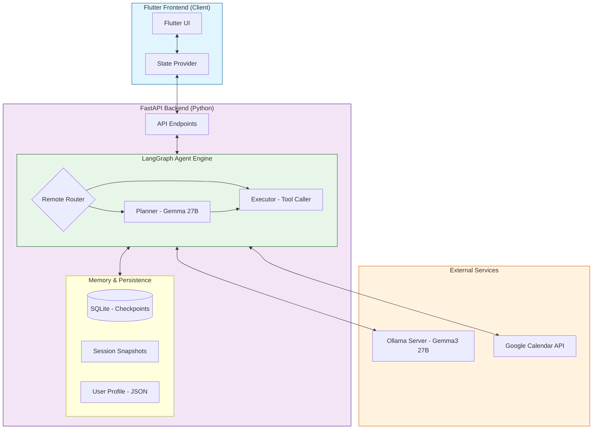
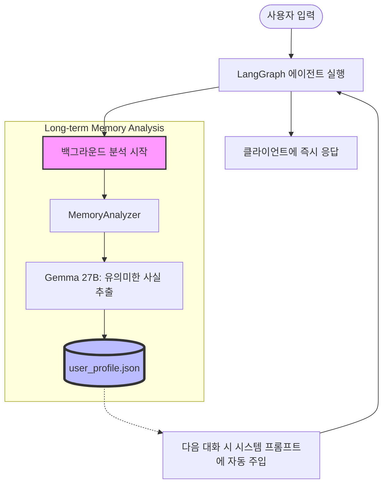

# AI 개인비서 Flutter 앱

**FunctionGemma 기반 AI 에이전트** - Ollama 서버 연동 및 온디바이스 추론을 지원하는 스마트 개인 비서 앱

## 주요 기능

- ✅ **LangGraph 기반 대화형 AI**: 로컬(270M) 및 서버(27B) 모델을 유기적으로 활용하는 하이브리드 추론 엔진
- ✅ **Google 캘린더 지능형 연동**: 자연어를 통한 일정 조회, 생성, 삭제 및 다중 캘린더 지원
- ✅ **지능형 하이브리드 메모리 시스템**: 
  - **세션 영속성 (Persistence)**: SqliteSaver 기반의 multi-turn 대화 상태 자동 저장 및 복구
  - **세션 스냅샷 (관리 기능)**: 모든 대화 기록을 `data/sessions/YYYY-MM-DD/` 폴더에 일자별로 자동 백업하여 관리 편의성 제공
  - **단기 컨텍스트 (ContextManager)**: 최근 작업물(ID, 제목 등)을 추적하여 "방금 잡은 일정 취소해줘"와 같은 지칭어 처리 지원
  - **장기 기억 분석 (Memory Analysis)**: 대화 종료 후 **백그라운드에서 AI가 대화 내용을 자동 분석**하여 사용자의 선호도, 직업, 중요 인물 등 핵심 사실(Facts)을 `user_profile.json`에 영구 저장. 다음 대화 시 이 프로필이 시스템 프롬프트에 자동으로 주입되어 개인화된 응답 구현
- ✅ **견고한 가드레일 (Guardrails)**: 
  - **ID 홀루시네이션 방지**: 캘린더 ID와 이벤트 ID의 혼동을 자동으로 감지하고 컨텍스트 기반으로 교정
  - **ID 절단(Truncation) 수정**: 응답 중 잘린 캘린더 ID(@group... 이후 누락 등)를 원본 맵과 대조하여 자동 복구
- ✅ **다국어 자동 지원**: 한국어와 영어 사용자 입력을 감지하여 해당 언어로 자연스럽게 응답
- ✅ **프리미엄 UI/UX**: Markdown 렌더링, 다크/라이트 테마, 실시간 상태 인디케이터 제공
- ✅ **관리용 스크립트 제공**: 인증 문제 발생 시 `python scripts/reauth.py`를 통해 간편하게 Google 인증 갱신 지원

## 기술 스택

### Frontend (Client)
- **Flutter** 3.9+ (Dart ^3.9.2)
- **Provider** (State Management)
- **GoRouter** (Navigation)
- **MediaPipe GenAI** (On-device LLM ready)

### Backend
- **FastAPI** (High-performance Python Web Server)
- **LangChain** & **LangGraph** (Agent Orchestration & Workflow)
- **Ollama** (LLM Server, Gemma3:27b / 4b)
- **Sqlite3** (Session Checkpoints & Context Store)

## 전체 시스템 아키텍처 (System Architecture)

본 서비스는 고성능 LLM 기반의 에이전트 엔진과 캘린더 API가 결합된 구조를 가집니다.



## 프로젝트 구조

```
├── backend/                  # Python FastAPI 백엔드
│   ├── app/
│   │   ├── agent/           # LangGraph 에이전트 핵심 로직
│   │   ├── services/        # 비즈니스 서비스 레이어
│   │   │   ├── context_manager.py # 최근 생성 이벤트 추적 (Short-term)
│   │   │   └── memory.py    # 세션 스냅샷 및 프로필 관리 (Long-term)
│   │   └── ...
│   ├── scripts/             # 유지보수 및 유틸리티 스크립트
│   │   └── reauth.py        # Google Calendar 인증 토큰 갱신
│   ├── tests/               # 체계적인 테스트 스위트
│   └── data/                # 로컬 데이터베이스 및 세션 저장소
│       ├── sessions/        # 일자별 대화 기록 스냅샷 (YYYY-MM-DD/ 형식)
│       ├── checkpoints.db   # LangGraph 세션 상태 DB
│       ├── context_v3.db    # 단기 작업 컨텍스트 DB
│       └── user_profile.json # 지능형 장기 기억 (User Facts) 데이터베이스
├── client/                  # Flutter 클라이언트 (Frontend)
│   ├── lib/
│   │   ├── presentation/    # UI 컴포넌트 및 Provider
│   │   ├── domain/          # 비즈니스 엔티티 및 인터페이스
│   │   └── data/            # API 연동 및 데이터 처리
│   └── assets/              # 로컬 LLM 모델(GGUF) 및 리소스
```

## 지능형 하이브리드 메모리 아키텍처

본 프로젝트는 단기 맥락 유지와 장기 개인화를 위해 설계된 **3단계 하이브리드 메모리 시스템**을 사용합니다.

### 1. 3-Layer Memory 구조
- **Layer 1: 실시간 상태 (LangGraph Checkpoints)**: 대화 중의 모든 이전 메시지를 추적하여 매끄러운 Multi-turn 대화를 지원합니다.
- **Layer 2: 단기 작업 컨텍스트 (ContextManager)**: 최근 생성된 캘린더 이벤트 ID 등을 캐싱하여 "그거 취소해줘"와 같은 지칭어를 즉시 처리합니다.
- **Layer 3: 장기 지능형 프로필 (User Profile Analysis)**: 대화 종료 후 비동기적으로 사용자의 핵심 정보를 추출하여 지식화합니다.

### 2. 장기 기억 분석 프로세스 다이어그램


### 3. 데이터 흐름 상세
- **추출(Extraction)**: 사용자가 "나는 목요일 오후에는 항상 운동을 해"라고 말하면, AI가 대화 종료 후 이를 감지하여 `{"weekly_routine": "Exercise on Thursday afternoon"}`으로 정형화합니다.
- **보관(Persistence)**: 정형화된 데이터는 일시적인 세션이 끝나도 사라지지 않고 서버의 `data/user_profile.json`에 영구 보관됩니다.
- **활용(Utilization)**: 다음 주에 "나 운동 갈 수 있어?"라고 물으면, AI는 캘린더 데이터뿐만 아니라 저장된 장기 기억을 바탕으로 "목요일 오후라 운동 시간이네요!"라고 개인화된 답변을 제공합니다.

## 시작하기

### 사전 요구 사항 (Prerequisites)

이 앱은 **Ollama**를 모델 서버로 사용합니다. 최적의 성능을 위해 다음 모델들을 미리 다운로드해야 합니다:
```bash
ollama pull gemma3:27b  # Planner/Executor용 (고성능)
ollama pull gemma3:4b   # Router용 (빠른 반응속도)
```
> [!NOTE]
> 27B 모델 실행을 위해 최소 16GB 이상의 VRAM을 권장합니다.

### 설치 및 설정

1. **Backend 설정**
   ```bash
   cd backend
   python -m venv venv
   .\venv\Scripts\activate  # Windows
   pip install -r requirements.txt
   ```

2. **환경 변수 설정**
   `backend/.env` 파일을 만들고 아래 내용을 입력합니다:
   ```text
   GOOGLE_API_KEY=your_google_ai_studio_api_key
   OLLAMA_HOST=http://localhost:11434
   OLLAMA_MODEL_PLANNER=gemma3:27b
   OLLAMA_MODEL_ROUTER=gemma3:4b
   ```

3. **Google OAuth 설정**
   - [Google Cloud Console](https://console.cloud.google.com/)에서 **Google Calendar API**를 활성화합니다.
   - OAuth 2.0 클라이언트 ID를 생성하고 `credentials.json` 파일을 다운로드하여 `backend/` 폴더에 배치합니다.
   - 첫 실행 전 또는 인증 만료 시 아래 명령어로 인증을 수행합니다:
     ```bash
     python scripts/reauth.py
     ```

4. **Backend 실행**
   ```bash
   # 가상환경 활성화 후 실행
   .\venv\Scripts\activate
   uvicorn app.main:app --host 0.0.0.0 --port 8000 --reload

   # 또는 한 줄로 실행
   .\venv\Scripts\python -m uvicorn app.main:app --host 0.0.0.0 --port 8000 --reload
   ```

5. **Flutter 앱 실행**
   ```bash
   cd client
   flutter pub get
   
   # 1. 사용할 수 있는 에뮬레이터 확인
   flutter emulators
   
   # 2. 에뮬레이터 실행 (예: Pixel_9)
   flutter emulators --launch Pixel_9
   
   # 3. 특정 디바이스로 앱 실행
   flutter run -d chrome
   flutter run -d windows
   flutter run -d emulator-5554  # 실행된 에뮬레이터 ID
   ```

## 개발 및 테스트

### 백엔드 테스트 실행 가이드

다양한 시나리오를 검증하기 위해 분리된 통합 테스트를 지원합니다:

```powershell
cd backend
# 1. 자연어 프롬프트 시나리오 (기본 응답 기능)
python tests\integration\run_llm_natural_language_prompt_scenarios.py

# 2. 지능형 메모리 시나리오 (이전 대화 기억 및 지칭어 처리)
python tests\integration\run_llm_memory_scenarios.py

# 3. 캘린더 전체 시나리오 (조회/생성/삭제 통합)
python tests\integration\run_calendar_scenarios.py

# 4. 전체 단위 테스트
pytest tests\unit\
```

## API 명세 (Key Endpoints)

- `GET /status`: 서버 연결 및 모델 로드 상태 확인
- `POST /api/chat`: 대화 엔진 호출
  - `thread_id`: 대화 맥락 유지를 위한 고유 ID (생략 시 자동 생성)
- `POST /api/unload`: 리소스 절약을 위해 GPU 메모리에서 LLM 즉시 언로드

## 문제 해결 (Troubleshooting)

- **Q: "Google Token is invalid (invalid_grant)" 오류가 발생합니다.**
  - **A:** 보안 정책이나 만료로 인해 토큰이 무효화된 상태입니다. `backend` 폴더에서 `python scripts/reauth.py`를 실행하여 다시 로그인하세요.
- **Q: 8000 포트가 이미 사용 중이라는 오류(`OSError: [WinError 10048]`)가 발생합니다.**
  - **A:** 기존 서버 프로세스가 종료되지 않은 경우입니다. 아래 명령어로 해당 포트를 점유 중인 프로세스를 강제 종료하세요:
    ```powershell
    # Windows (PowerShell)
    Stop-Process -Id (Get-NetTCPConnection -LocalPort 8000).OwningProcess -Force
    
    # Windows (CMD)
    Get-NetTCPConnection -LocalPort 8000 | ForEach-Object {Stop-Process -Id $_.OwningProcess -Force}

    ```
- **Q: 응답 속도가 너무 느립니다.**

  - **A:** 시스템 사양에 따라 `OLLAMA_MODEL_PLANNER`를 `gemma3:4b` 등 더 가벼운 모델로 변경하여 테스트해 보세요.

## 진행 상황 및 로드맵

- ✅ **Phase 1-3**: 기본 인프라, 캘린더 연동, 하이브리드 라우팅 (완료)
- ✅ **Phase 4**: LangGraph 및 SQLite 기반 지능형 메모리 & 장기 기억 분석 시스템 (완료)
- ✅ **Phase 4.5**: ID 교정 가드레일 및 안정성 강화 (완료)
- ✅ **Phase 4.6**: 일자별 세션 관리 및 인증 유틸리티 최적화 (완료)
- ✅ **Phase 5**: 배포 자동화 및 보안 강화 (완료)
- ✅ **Phase 6**: 코드 품질 개선 및 린트 최적화 (완료)


**현재 버전**: 1.0.0 (Stable)  
**최근 업데이트**: 2025-12-30

---

## 모델 성능 평가 이력 (Model Evaluation History)

### Local Router (FunctionGemma-270M) 성능 평가 (2025-12-30)
초기 설계된 온디바이스 하이브리드 라우팅의 실효성을 검증하기 위해 벤치마크를 수행했습니다.

- **테스트 환경**: Local LlamaCpp (functiongemma-270m-it-q8_0.gguf)
- **평가 항목**: 의도 분류 (answer, simple, complex)
- **결과 요약**:
  - **정확도 (Accuracy)**: **14.3% (1/7)**
  - **주요 결함**: 자연어 의도 파악 오류, JSON 출력 형식 불완전, 복잡한 문장 해석 불가.
- **결정**: 로컬 모델의 낮은 신뢰도로 인해 사용자 경험을 해칠 수 있다고 판단, 온디바이스 라우팅 로직을 모두 제거하고 고성능 리모트 모델(Gemma3:27b)로 단일화함.

