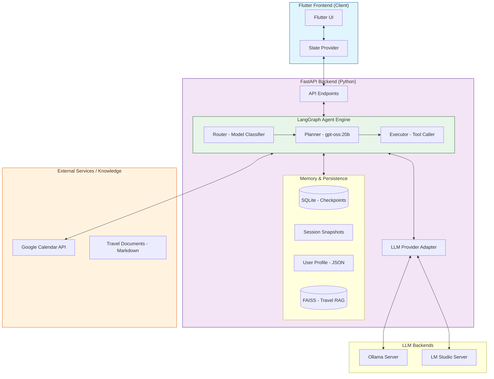

# AI 개인비서 Flutter 앱

**LangGraph 기반 AI 에이전트** - Ollama 서버(gpt-oss:20b)를 활용한 싱글 모델 아키텍처 개편 및 스마트 개인 비서 앱

## 주요 기능

- ✅ **LangGraph 기반 대화형 AI**: Ollama 서버의 gpt-oss:20b 모델을 활용한 고성능 싱글 모델 추론 엔진 (Manual JSON Parsing 적용)
- ✅ **Google 캘린더 지능형 연동**: 자연어를 통한 일정 조회, 생성, 삭제 및 다중 캘린더 지원
- ✅ **지능형 하이브리드 메모리 & RAG**: 
  - **세션 영속성 (Persistence)**: SqliteSaver 기반의 multi-turn 대화 상태 자동 저장 및 복구
  - **세션 스냅샷 (관리 기능)**: 모든 대화 기록을 `data/sessions/YYYY-MM-DD/` 폴더에 일자별로 자동 백업
  - **단기 컨텍스트 (ContextManager)**: 최근 작업물(ID, 제목 등)을 추적하여 "방금 잡은 일정 취소해줘" 처리 지원
  - **장기 기억 분석 (Memory Analysis)**: 백그라운드에서 사용자의 핵심 사실(Facts)을 추출하여 `user_profile.json`에 저장
  - **회의록 요약 및 자동 일정 등록 (v1.6.0 NEW)**: 복잡한 회의록 원문을 분석하여 요약, 결정 사항을 추출하고 사용자 승인 후 일정 일괄 등록
  - **여행 지능형 RAG (Travel Retrieval)**: 오사카 여행 지침서(MD)를 FAISS로 인덱싱하여 비행기, 호텔 정보를 실시간 검색 및 답변 활용
- ✅ **견고한 가드레일 (Guardrails)**: 
  - **ID 홀루시네이션 방지**: 캘린더 ID와 이벤트 ID의 혼동을 자동으로 감지하고 컨텍스트 기반으로 교정
  - **ID 절단(Truncation) 수정**: 응답 중 잘린 캘린더 ID(@group... 이후 누락 등)를 원본 맵과 대조하여 자동 복구
- ✅ **다국어 자동 지원**: 한국어와 영어 사용자 입력을 감지하여 해당 언어로 자연스럽게 응답
- ✅ **프리미엄 UI/UX**: Markdown 렌더링, 다크/라이트 테마, 실시간 상태 인디케이터 제공
- ✅ **관리용 스크립트 제공**: 인증 문제 발생 시 `python scripts/reauth.py`를 통해 간편하게 Google 인증 갱신 지원

## 전체 시스템 아키텍처 (System Architecture)

본 서비스는 고성능 LLM 기반의 에이전트 엔진과 캘린더 API가 결합된 구조이며,
LLM Provider 추상화를 통해 Ollama/LM Studio를 앞단에서 교체할 수 있습니다.



## 프로젝트 구조

```
├── backend/                  # Python FastAPI 백엔드
│   ├── app/
│   │   ├── agent/           # LangGraph 에이전트 핵심 로직
│   │   ├── services/        # 비즈니스 서비스 레이어
│   │   │   ├── context_manager.py # 최근 생성 이벤트 추적 (Short-term)
│   │   │   └── memory.py    # 세션 스냅샷 및 프로필 관리 (Long-term)
│   │   └── ...
│   ├── scripts/             # 유지보수 및 유틸리티 스크립트
│   │   └── reauth.py        # Google Calendar 인증 토큰 갱신
│   ├── tests/               # 체계적인 테스트 스위트
│   └── data/                # 로컬 데이터베이스 및 세션 저장소
│       ├── sessions/        # 일자별 대화 기록 스냅샷 (YYYY-MM-DD/ 형식)
│       ├── checkpoints.db   # LangGraph 세션 상태 DB
│       ├── context_v3.db    # 단기 작업 컨텍스트 DB
│       └── user_profile.json # 지능형 장기 기억 (User Facts) 데이터베이스
├── client/                  # Flutter 클라이언트 (Frontend)
│   ├── lib/
│   │   ├── presentation/    # UI 컴포넌트 및 Provider
│   │   ├── domain/          # 비즈니스 엔티티 및 인터페이스
│   │   └── data/            # API 연동 및 데이터 처리
│   └── assets/              # 로컬 LLM 모델(GGUF) 및 리소스
```

## 시작하는 방법

이 프로젝트를 로컬 환경에서 실행하는 방법에 대한 자세한 내용은 다음 문서를 참조하세요:

*   [**설치 및 실행 가이드**](docs/getting_started.md)

## LLM Provider Configuration

Use these env vars to switch providers without touching the rest of the code.

```text
# Provider switch (ollama | lmstudio)
LLM_PROVIDER=ollama
LLM_BASE_URL=http://localhost:11434
LLM_API_KEY=
LLM_EMBEDDING_MODEL=nomic-embed-text

# Model selection (available on user's Ollama server)
LLM_MODEL=gpt-oss:20b
LLM_MODEL_ROUTER=gpt-oss:20b
LLM_MODEL_PLANNER=gpt-oss:20b
LLM_MODEL_EXECUTOR=gpt-oss:20b
LLM_KEEP_ALIVE=5m
# Alternative: llama3.1:8b, llama2:13b
```

LM Studio example:

```text
LLM_PROVIDER=lmstudio
LLM_BASE_URL=http://127.0.0.1:1234/v1
LLM_API_KEY=lm-studio
LLM_MODEL=zai-org/glm-4.6v-flash
LLM_MODEL_PLANNER=zai-org/glm-4.6v-flash
LLM_MODEL_EXECUTOR=zai-org/glm-4.6v-flash
```

Run with profile env files (recommended):

```powershell
cd backend
.\scripts\run_backend.ps1 -Profile lmstudio -Reload
```

`GET /status` response fields:

```json
{
  "status": "ok",
  "llm_provider": "lmstudio",
  "llm_base_url": "http://127.0.0.1:1234/v1",
  "llm_model": "zai-org/glm-4.6v-flash",
  "llm_connected": true,
  "llm_details": null,
  "google_api_configured": true,
  "version": "debug-1-check"
}
```

Note: LM Studio must have a model loaded (Developer tab) before chat requests will succeed.

## 추가 문서

더 자세한 내용은 다음 문서를 참조하세요:

*   [**AI 작업 맥락 및 워크플로우 가이드**](docs/ai_context_guide.md)
*   [**기술 스택**](docs/technical_stack.md)
*   [**지능형 하이브리드 메모리 아키텍처**](docs/hybrid_memory_system.md)
*   [**개발 및 테스트 가이드**](docs/development_and_testing.md)
*   [**API 명세**](docs/api_specification.md)
*   [**문제 해결**](docs/troubleshooting.md)
*   [**진행 상황 및 로드맵**](docs/roadmap_and_model_evaluation.md)
*   [**테스트 질문 예시**](docs/test_questions.md)

---
**현재 버전**: 1.6.0 (Stable)  
**최근 업데이트**: 2026-01-16
