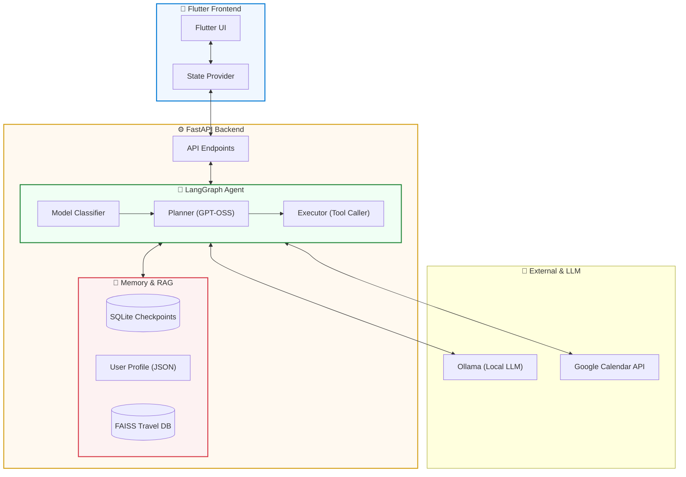

<div align="center">
  
  <h1>AI 개인비서 (AI Assistant Agent)</h1>
  <p><strong>LangGraph 기반 지능형 에이전트 & 스마트 비서</strong></p>

  [](https://github.com/your-repo)
  [](#기술-스택)
  [](#llm-provider-configuration)
  [](LICENSE)
</div>

---

## 🚀 프로젝트 개요

본 프로젝트는 **LangGraph**와 **Ollama**를 결합하여 개발된 지능형 AI 개인 비서입니다. 자연어 처리를 통한 일정 관리, 회의록 요약, 여행 정보 RAG 등 복잡한 태스크를 자율적으로 수행하며, 사용자 피드백을 통해 학습하고 최적화되는 구조를 가지고 있습니다.

## ✨ 주요 핵심 기능

### 🧠 지능형 에이전트 엔진
- **LangGraph 기반 오케스트레이션**: 복잡한 비즈니스 로직을 그래프 기반의 에이전트 워크플로우로 구현하여 높은 유연성 확보.
- **싱글 모델 아키텍처 (gpt-oss:20b)**: Ollama를 통한 모델 서버 통합 및 고성능 추론 (Manual JSON Parsing 적용).
- **자율 도구 호출 (Tool Calling)**: 상황에 맞는 최적의 API(Google Calendar, RAG Search 등)를 에이전트가 스스로 선택 및 실행.

### 💾 하이브리드 메모리 시스템
- **단기 작업 컨텍스트**: 최근 생성한 이벤트나 작업 ID를 추적하여 "방금 그거 취소해줘"와 같은 지시어 완벽 처리.
- **장기 기억 (User Profile)**: 대화 중 사용자의 취향, 고정 일정, 핵심 Facts를 추출하여 맞춤형 서비스 제공.
- **세션 영속성**: `SQLite` 기반 체크포인팅으로 대화 흐름이 끊기지 않는 심리스한 경험 제공.

### 📅 특화 비즈니스 시나리오
- **스마트 일정 관리**: Google Calendar API 연동, 중복 일정 감지 및 자연어 기반 자유로운 일정 조작.
- **회의 보조 (Meeting Assistant)**: 회의록 요약, 결정 사항 추출 및 사용자 승인 기반 일정 일괄 자동 등록.
- **여행 특화 RAG**: 전용 여행 가이드를 FAISS 벡터 DB로 인덱싱하여 비행기/호텔 정보 실시간 답변.

---

## 🛠 기술 스택 (Technical Stack)

<table align="center">
  <tr>
    <td align="center" width="120">
      <br /><b>Python 3.12+</b>
    </td>
    <td align="center" width="120">
      <br /><b>FastAPI</b>
    </td>
    <td align="center" width="120">
      <br /><b>Flutter</b>
    </td>
    <td align="center" width="120">
      <br /><b>SQLite</b>
    </td>
  </tr>
</table>

- **Backend**: FastAPI, LangGraph, LangChain, Pydantic, aiosqlite, FAISS
- **Frontend**: Flutter (Provider/Domain/Data Clean Architecture)
- **Infrastructure**: Ollama (Local LLM Serving), Google Calendar API

---

## 🏗 시스템 아키텍처 (Architecture)



---

## 📂 프로젝트 구조

```text
├── backend/                  # 🐍 Python FastAPI Service
│   ├── app/
│   │   ├── agent/           # LangGraph Core Logic
│   │   ├── services/        # Business Layer (Memory, Calendar, RAG)
│   │   └── core/            # Config & Logging
│   ├── scripts/             # Maintenance Utility
│   ├── tests/               # Integration & Unit Tests
│   └── data/                # Persistence Layer (Checkpoints, Profiles)
└── client/                   # 📱 Flutter Application
    ├── lib/                 # Clean Architecture Blocks
    └── assets/              # Static Resources & Web entry
```

---

## 🚦 시작하기 (Getting Started)

상세한 설치 및 실행 환경 설정은 가이드를 확인하세요.

👉 [**설치 및 실행 가이드 바로가기**](docs/getting_started.md)

---

## 📚 추가 문서 (Documentation)

| 문서명 | 주요 내용 |
| :--- | :--- |
| [AI 워크플로우 가이드](docs/ai_context_guide.md) | 에이전트의 사고 방식과 워크플로우 상세 |
| [하이브리드 메모리](docs/hybrid_memory_system.md) | 단기/장기 기억 저장 및 활용 원리 |
| [진행 상황 및 로드맵](docs/roadmap_and_model_evaluation.md) | 현재 버전 정보 및 향후 계획 |
| [API 명세서](docs/api_specification.md) | 백엔드 엔드포인트 상세 |

---
**Current Version**: `1.6.0 (Stable)` | **Last Updated**: `2026-01-16`
