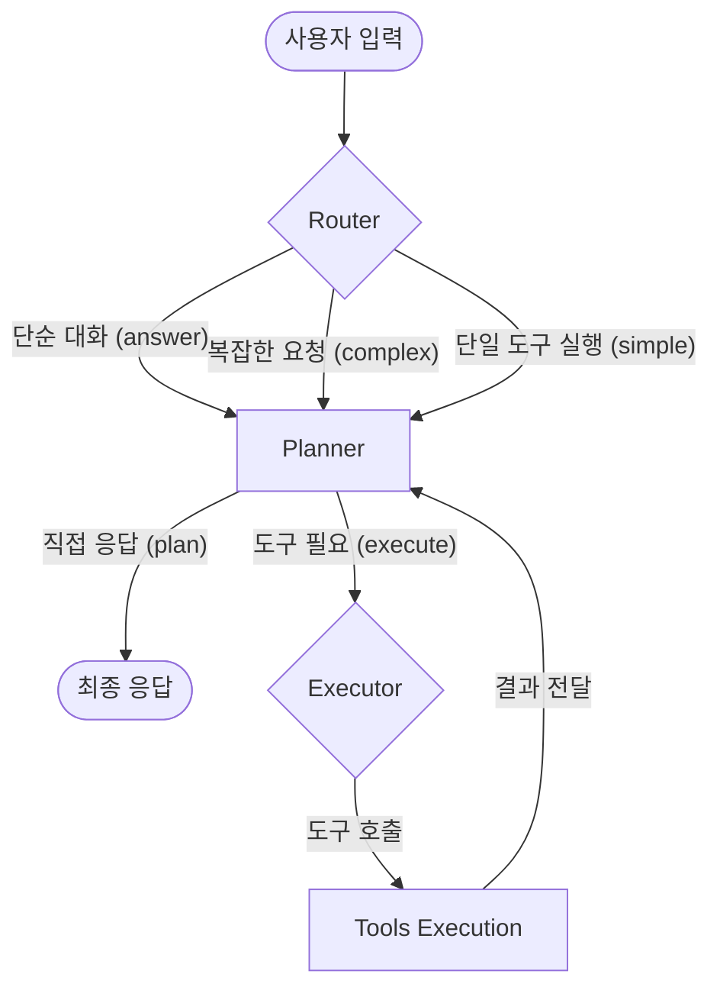

# AI 작업 맥락 및 워크플로우 가이드 (AI Context & Workflow Guide)

본 문서는 AI 개인비서 시스템이 사용자의 요청을 처리하는 내부 워크플로우와 다양한 레이어의 맥락(Context) 관리 방식을 상세히 설명합니다.

## 1. 핵심 에이전트 워크플로우 (Core Workflow)

에이전트는 **LangGraph**를 기반으로 한 상태 머신 구조로 동작하며, 요청의 복잡도에 따라 유연하게 경로를 결정합니다.

1.  **Router**: 입력한 메시지의 의도를 파악하여 '단순', '복잡', '답변' 모드로 분류합니다.
2.  **Planner**: 현재 상태와 과거 맥락을 분석하여 다음 단계(직접 답변 또는 도구 실행)를 계획합니다.
3.  **Executor**: Planner의 계획을 구체적인 도구 호출(Tool Calls)로 변환하며, 이 과정에서 캘린더 ID 보정 등의 가드레일이 작동합니다.

## 2. 하이브리드 맥락 관리 (Hybrid Context Management)

시스템은 사용자의 정보를 최적으로 유지하기 위해 세 단계의 메모리 계층을 사용합니다.

### A. 초단기 맥락 (Short-term: ContextManager)
- **목적**: "방금 만든 거 취소해줘"와 같은 지시 대상을 추적.
- **구현**: `backend/data/context_v3.db` (SQLite)
- **내용**: 최근 생성/수정된 이벤트 ID, 요약 정보 기록.

### B. 중기 맥락 (Mid-term: Persistence)
- **목적**: 현재 세션 내의 대화 흐름(Multi-turn) 유지.
- **구현**: `backend/data/checkpoints.db` (LangGraph SqliteSaver)
- **내용**: 대화 전체 히스토리 및 에이전트 상태.
- **백업**: `backend/data/sessions/` 폴더에 일자별 JSON 스냅샷 자동 저장.

### C. 장기 맥락 (Long-term: Intelligent Memory)
- **목적**: 사용자의 고정 정보 및 반복되는 패턴 학습.
- **구현**: `backend/data/user_profile.json`
- **구조**:
  - `user`: 이름, 선호하는 캘린더 리스트 등 고정 정보.
  - `patterns`: 대화 중 발견된 반복적 습관.
  - `facts`: 추출된 주요 사실들.
  - `history`: 이전 세션들의 요약본 (최근 20개).

## 3. 지능형 RAG 및 도구 연동 (Intelligent RAG & Tools)

### 여행 정보 검색 (Travel RAG)
- **대상**: `backend/knowledge/travel/` 내의 가이드 문서.
- **방식**: FAISS 벡터 DB를 통한 시맨틱 검색.
- **특징**: 오사카 여행 등의 특정 주제에 대해 항공편, 숙소 정보를 실시간으로 검색하여 답변에 반영.

### 구글 캘린더 연동
- 사용자의 자연어 요청을 `list_events`, `create_event`, `delete_event` 등 API 호출로 정밀하게 변환합니다.

## 4. 견고성 유지 (Guardrails)

AI의 실수를 방지하기 위해 다음과 같은 가드레일을 적용합니다.

- **ID 홀루시네이션 보정**: 캘린더 ID 대신 이메일을 사용하거나, 이벤트 ID를 잘못 생성하는 경우 컨텍스트와 대조하여 자동 교정합니다.
- **ID 절단 복구**: 응답 중 토큰 제한 등으로 인해 잘린 긴 ID 문자열을 원본 데이터 맵을 참조하여 복구합니다.
- **다국어 매칭**: 사용자의 언어(한국어/영어)를 감지하여 Planner와 Executor가 동일 언어로 사고하고 응답하도록 강제합니다.
