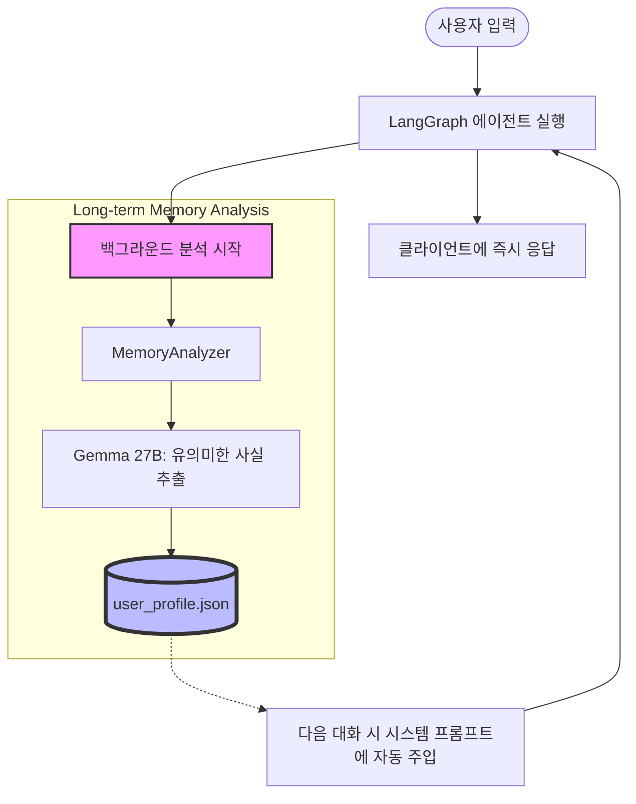
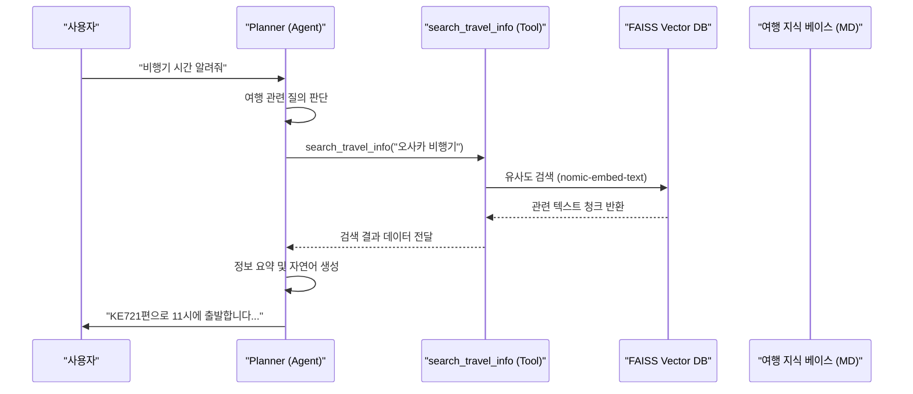

# 지능형 하이브리드 메모리 아키텍처

본 프로젝트는 단기 맥락 유지와 장기 개인화를 위해 설계된 **3단계 하이브리드 메모리 시스템**을 사용합니다.

### 1. 3-Layer Memory 구조
- **Layer 1: 실시간 상태 (LangGraph Checkpoints)**: 대화 중의 모든 이전 메시지를 추적하여 매끄러운 Multi-turn 대화를 지원합니다.
- **Layer 2: 단기 작업 컨텍스트 (ContextManager)**: 최근 생성된 캘린더 이벤트 ID 등을 캐싱하여 "그거 취소해줘"와 같은 지칭어를 즉시 처리합니다.
- **Layer 3: 장기 지능형 프로필 (User Profile Analysis)**: 대화 종료 후 비동기적으로 사용자의 핵심 정보를 추출하여 지식화합니다.

### 2. 장기 기억 분석 프로세스 다이어그램


### 3. 오사카 여행 지침서 (Travel RAG)
사용자의 다가올 오사카 여행 정보를 별도의 지식 베이스(Markdown)로 관리하며, 필요 시 RAG(Retrieval-Augmented Generation)를 통해 관련 정보를 실시간으로 추출하여 답변에 활용합니다.

#### [RAG 처리 프로세스]


#### [지식 추출 및 답변 생성 원리]
에이전트가 지식 베이스에서 정보를 가져와 답변하는 과정은 크게 3단계로 이루어집니다:

1. **지능형 검색 (Retrieval)**:
   - 사용자의 질문이 들어오면 `nomic-embed-text` 모델을 통해 수치화된 벡터로 변환됩니다.
   - 변환된 벡터는 미리 색인된 **FAISS** 벡터 데이터베이스에서 가장 의미적으로 유사한 텍스트 조각(Chunk)들을 찾아냅니다.
   - 단순히 키워드가 일치하는 것이 아니라, "공항 가는 법"과 "항공권 정보" 같은 맥락적 유사성을 탐색합니다.

2. **컨텍스트 주입 (Augmentation)**:
   - 검색된 상위 5개의 지식 조각들은 에이전트(Planner)의 시스템 프롬프트에 실시간으로 주입됩니다.
   - 에이전트는 사용자의 질문 뒤에 숨겨진 "지식 베이스의 실제 데이터"를 배경지식으로 갖게 됩니다.

3. **추론 및 답변 생성 (Generation)**:
   - 에이전트는 주입된 지식을 바탕으로 사용자의 언어(한국어/영어)에 맞춰 자연스러운 문장으로 답변을 재구성합니다.
   - 만약 정보가 부족하다면 추가 질문을 던지거나, 정확한 데이터(편명, 전화번호 등)를 인용하여 신뢰도 높은 답변을 내놓습니다.

- **기술적 특징**:
    - **임베딩 모델**: `nomic-embed-text` (Ollama) 사용, 고성능 시맨틱 검색 지원
    - **벡터 스토어**: **FAISS** 기반 로컬 인덱싱으로 빠른 검색 속도 보장
    - **Prefix 적용**: 검색 성능 최적화를 위해 질의(`search_query:`)와 문서(`search_document:`)에 각각 전용 접두사 부여
    - **확장성**: `backend/knowledge/travel/` 폴더에 새로운 Markdown 파일을 추가하는 것만으로 지식 확장 가능

#### [RAG 데이터 관리 및 인덱싱 방법]
새로운 여행 정보를 추가하거나 기존 정보를 수정한 후에는 반드시 인덱스를 업데이트해야 합니다.
1. `backend/knowledge/travel/` 경로에 `.md` 파일 추가/수정
2. 다음 명령어를 실행하여 벡터 DB 업데이트:
   ```bash
   cd backend
   $env:PYTHONPATH="."  # Windows (PowerShell)
   .\venv\Scripts\python scripts/index_travel.py
   ```

#### [RAG 샘플 질문 예시]
- "오사카 가는 비행기 편명하고 시간 알려줘"
- "우리 숙소 주소랑 체크인 시간 확인해줄래?"
- "도톤보리 근처에서 먹을만한 라멘집 추천해줘"
- "여행 2일차 일정 좀 다시 보여줘"

### 4. 데이터 흐름 상세
- **추출(Extraction)**: 사용자가 "나는 목요일 오후에는 항상 운동을 해"라고 말하면, AI가 대화 종료 후 이를 감지하여 `{"weekly_routine": "Exercise on Thursday afternoon"}`으로 정형화합니다.
- **보관(Persistence)**: 정형화된 데이터는 일시적인 세션이 끝나도 사라지지 않고 서버의 `data/user_profile.json`에 영구 보관됩니다.
- **활용(Utilization)**: 다음 주에 "나 운동 갈 수 있어?"라고 물으면, AI는 캘린더 데이터뿐만 아니라 저장된 장기 기억을 바탕으로 "목요일 오후라 운동 시간이네요!"라고 개인화된 답변을 제공합니다.