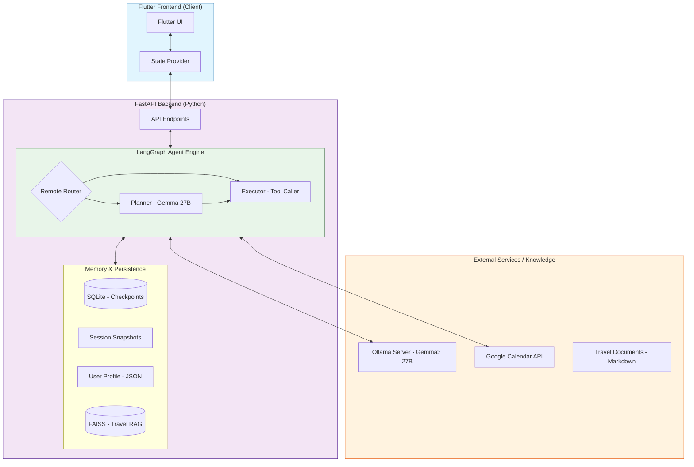

# 프로젝트 개요

AI 개인비서 앱은 FunctionGemma 기반의 에이전트를 중심으로 캘린더 관리, 여행 정보 조회, 온디바이스 추론을 결합한 하이브리드 비서 서비스입니다. 백엔드는 FastAPI와 LangGraph로 오케스트레이션하고, 클라이언트는 Flutter로 동작합니다.

## 주요 기능

- LangGraph 기반 대화형 에이전트: 서버(Ollama Gemma3) 중심, 필요 시 온디바이스 LLM을 선택적으로 활용
- Google 캘린더 통합: 일정 조회, 생성, 삭제, 다중 캘린더 지원
- 하이브리드 메모리: Sqlite 체크포인트, 세션 스냅샷, 장기 사용자 프로필 추출 및 재사용
- 가드레일: 캘린더 ID 혼동 감지/교정, 잘린 ID 복원
- 다국어 지원: 한국어/영어 자동 감지 후 해당 언어로 응답
- RAG 기반 여행 비서: `backend/knowledge/travel/*.md`를 FAISS로 색인하여 오사카 여행 정보 응답

## 기술 스택

- Backend: Python 3.11+, FastAPI, LangChain & LangGraph, Ollama(Gemma3), SQLite, FAISS
- Client: Flutter 3.9+ (Dart ^3.9.2), Provider, GoRouter, MediaPipe GenAI, Flutter Markdown

## 시스템 아키텍처



## 메모리와 지식 처리

### 하이브리드 메모리
- LangGraph 체크포인트: `backend/data/checkpoints.db`
- 단기 컨텍스트: `app/services/context_manager.py`에서 최근 생성 이벤트를 추적
- 장기 프로필: `data/user_profile.json`에 사용자 사실(Facts)과 대화 요약을 저장, 추론 시 시스템 프롬프트에 주입

### Travel RAG
- 데이터 경로: `backend/knowledge/travel/*.md`
- 인덱싱: `backend/scripts/index_travel.py`
- 질의 시 nomic-embed-text + FAISS를 사용해 관련 청크를 Planner에게 전달

## 프로젝트 구조 요약

```
├── backend/
│   ├── app/                # FastAPI + LangGraph 에이전트
│   ├── knowledge/travel/   # 여행 RAG 지식 베이스(Markdown)
│   ├── scripts/            # 유지보수/인덱싱 스크립트
│   └── verification/       # 상태/채팅 확인 스크립트
├── client/                 # Flutter 프런트엔드
│   ├── lib/                # UI, Provider, 데이터 계층
│   └── pubspec.yaml        # 의존성 및 온디바이스 모델 자산 경로
├── data/                   # 체크포인트와 사용자 프로필 저장소
└── test_payload.json       # 간단한 채팅 페이로드 샘플
```
